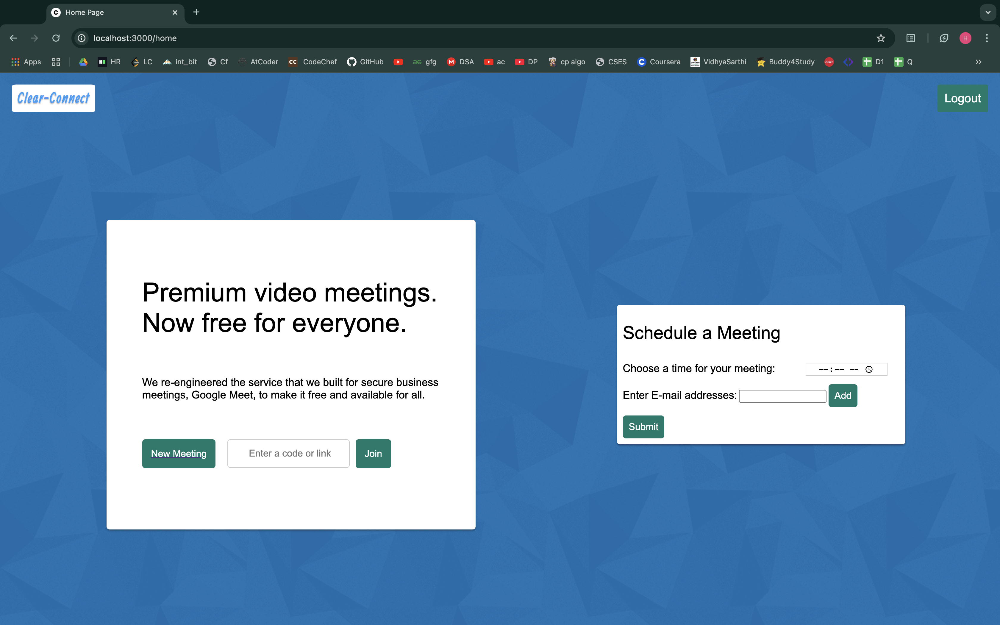
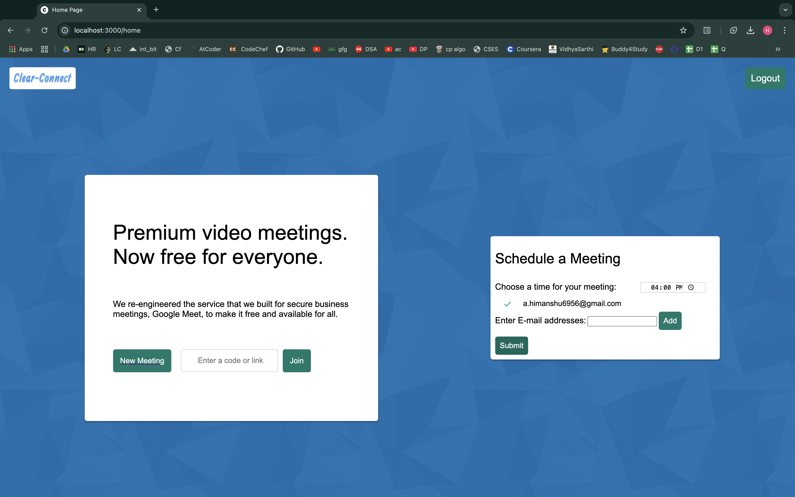
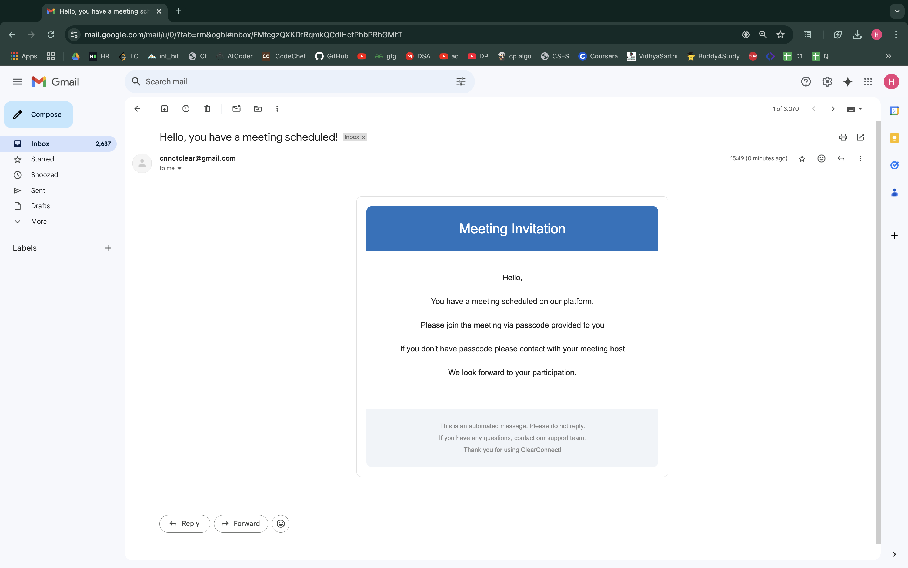
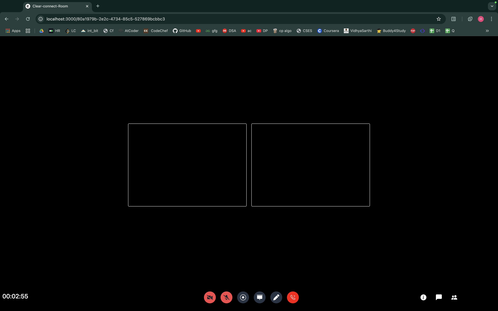
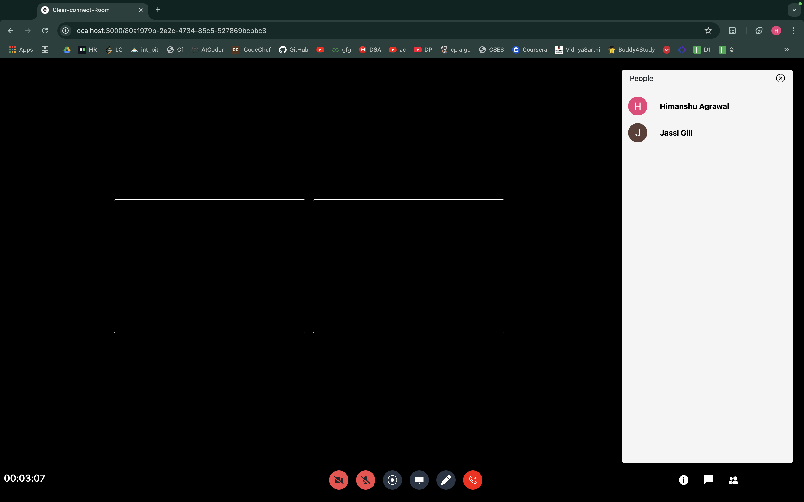
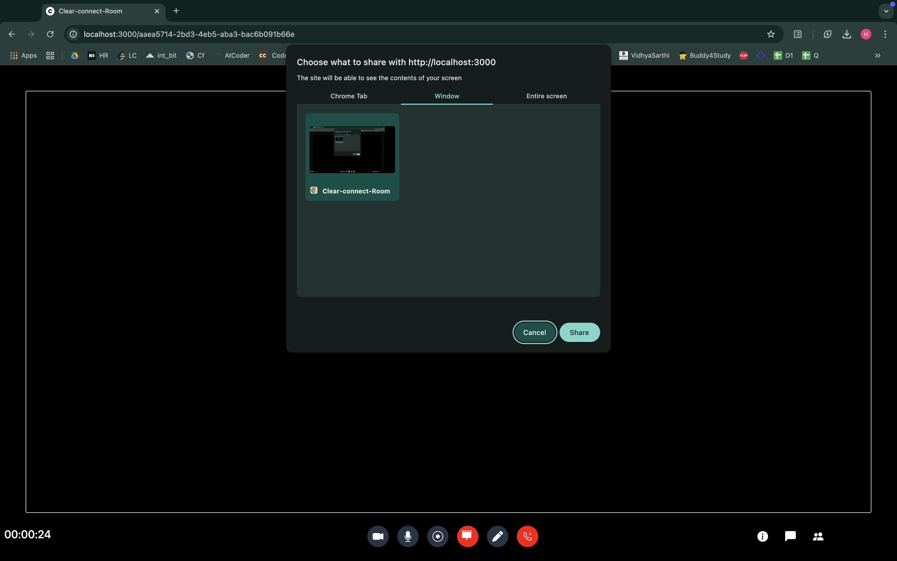
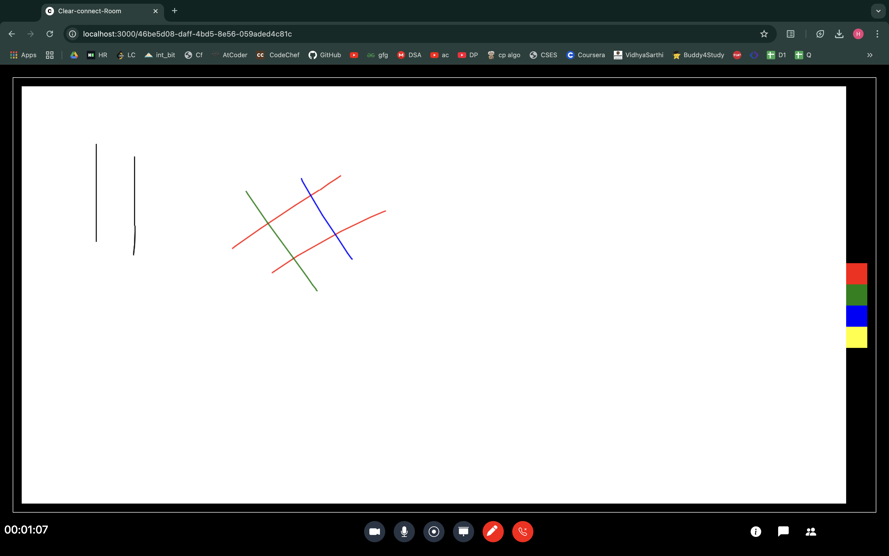
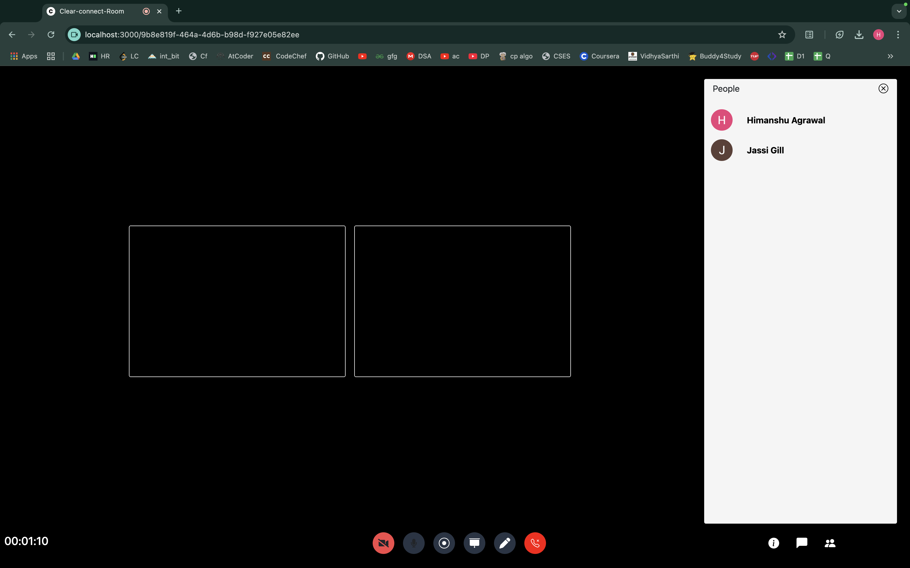
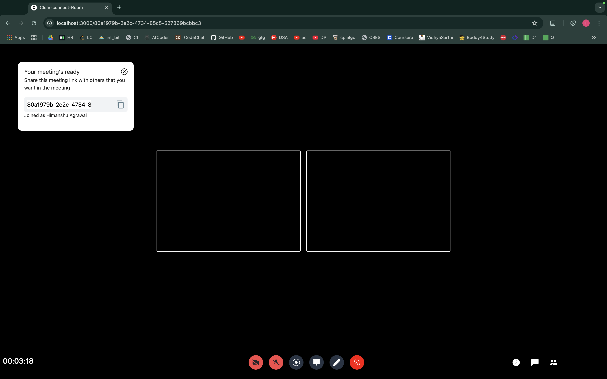
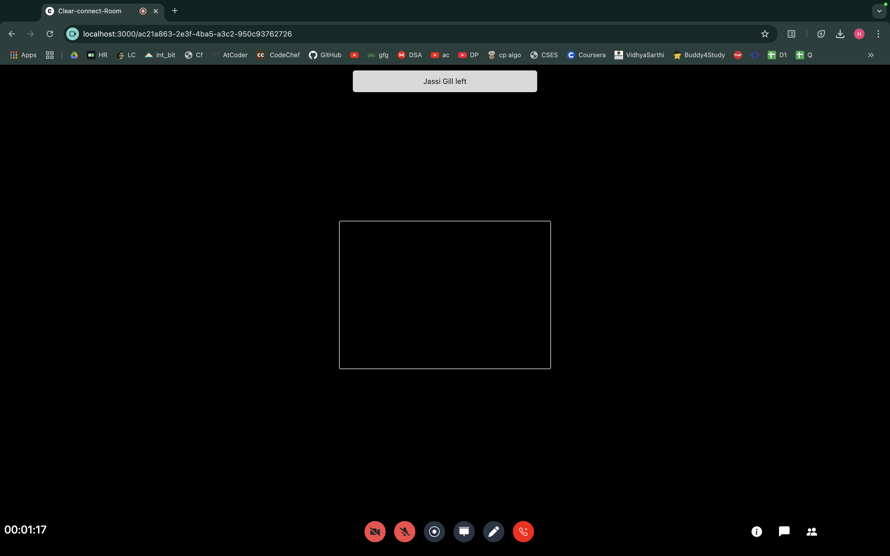

# ClearConnect Web Application

Contents

* [Introduction](#introduction) 
* [Features & Specialities](#key-features--specialities) 
* [Techsacks used, installation, execution](#techstacks) 
* [Snippets of web application](#web-application-snippets) 

## Introduction

This is Node.js-based video call application that utilizes socket.io and peerjs libraries to establish peer-to-peer connections. It provides video-calling and real time chat functionality. Additionally, it offers features such as screen sharing and whiteboard sharing.

## Key Features & Specialities

* Group video and audio call
* Real time chat
* Screen share
* Audio and video controls
* View Participants
* Reminder Email
* Google Authentication
* Sharable whiteboard
* Dedicated Leave meeting option
* Easy to use UI

## Techstacks

### Techstacks used
* Node.js
* HTML
* CSS
* Bootstrap
* Javascript

### Libraries used

* Socket.io
* Express
* Peerjs
* Nodemailer
* Passport js
* dotenv
* uuid

### Installation

1. Clone the repository `git clone https://github.com/himanshu6956/Clear-Connect`

2. Install all packages and project dependencies `npm install`

3. To run the webapp on localhost generate your Google Oauth credentials from [Google Developer Console](https://console.cloud.google.com/ "google developer console") by creating a new project and set the URI to `localhost:3000` and callback URI `localhost:3000/auth/google/callback`

4. Create a .env file and add your Credentials here along with your Gmail ID and Password for Reminder Email message

### Execution

* Start the server `npm start` or `nodemon server.js` 

## Web Application Snippets

1. Google Authentication 

 

2. After google authentication user can either choose to join a new meeting or join an existing meeting by entering the meeting-room ID 

 

3. Meeting room 

 

4. Meeting room 

 

5. Meeting room 

 
NOTE: Video of participant were kept off for security reasons 

6. Chat facility 

 

7. Screen-share feature 

 

8. Whiteboard 

 

9. Participant-list 

 

10. Meeting Passcode 

 

11. Alert everyone in the meeting when a participant leaves the meeting 

 

>Happy Coding !!
